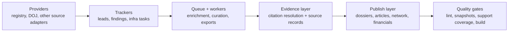

# Ithildin

Ithildin is an investigative tooling platform for evidence-linked research. It combines provider/query tools, a queue-backed workflow layer, a source-record aware citation system, and a static publishing surface for dossiers, articles, network views, and financial traces.

This repository is the public portfolio cut. It keeps the platform surface and a reproducible demo fixture while leaving out the active private investigation workspace.

## Why this project matters

- Investigative workflows rarely have uniform source quality. Ithildin distinguishes between public artifacts, hosted copies, and metadata-only source records instead of flattening them into one citation concept.
- The platform preserves provenance through the stack: query/provider tools, finding records, queue workers, citation rendering, support coverage, and static publishing.
- Reviewers get a clean path: clone, install, run the demo, inspect the output, and trace claims back to source records.

## Architecture



## Quickstart

```bash
make setup
make test
make demo
```

`make test` and `make demo` both point the app at the bundled fixture under [`examples/portfolio-demo`](examples/portfolio-demo/README.md). No private investigation database is required.

The demo fixture includes:

- 2 dossiers
- 1 article
- 11 findings
- mixed citation types:
  - public artifact
  - hosted copy
  - metadata-only source record

## Canonical CLI

The public CLI is `ithildin`.

```bash
uv run ithildin lead --help
uv run ithildin finding --help
uv run ithildin queue --help
uv run ithildin query registry search "Harbor Ledger"
uv run ithildin build demo
```

## Representative Screens

After `make demo`, use these routes as the fastest tour of the platform:

- `/` for the platform overview
- `/articles/port-watch-procurement-network` for the case-study narrative
- `/dossiers/harbor-ledger-holdings` for dossier and evidence mode
- `/sources/port-watch-call-notes-2025-02-14-du8pqr` for a metadata-only source record
- `/financials` for the curated flow view

## Quality Checks

- Top-level path: `make test`
- Python: `uv run pytest -m 'not live_data' -q`
- Optional live CourtListener suite: `uv run pytest -m live_data tests/test_courtlistener_live.py -q`
- Web type/content checks: `npm run check --prefix web`
- Citation checks: `npm run test:citations --prefix web`
- Citation snapshots: `npm run test:citations:snapshots --prefix web`
- Demo build: `make demo`

## Portfolio Case Study

The main case-study surface in this repo is:

- Article: `/articles/port-watch-procurement-network`
- Dossiers:
  - `/dossiers/harbor-ledger-holdings`
  - `/dossiers/lina-ortega`

The article is intentionally compact. Its job is to demonstrate the platform’s evidence model and reviewer ergonomics, not to maximize narrative scope.

## Deployment

The Astro app is configured for Cloudflare Pages. After authenticating Wrangler and creating a Pages project named `ithildin-portfolio`, deploy with:

```bash
npm run deploy --prefix web
```

The included GitHub Actions workflow can also deploy automatically once the new repo is connected to GitHub and the Cloudflare secrets are configured.

## Repo Structure

- [`ithildin`](ithildin) for the canonical CLI, shared config, and portfolio-facing Python package surface
- [`tools`](tools) for provider and operational adapters retained behind the public CLI
- [`queue_system`](queue_system) for queue and worker infrastructure
- [`pipeline`](pipeline) for export/build helpers
- [`web`](web) for the Astro frontend and citation/source-record rendering
- [`examples/portfolio-demo`](examples/portfolio-demo/README.md) for the reproducible demo dataset
